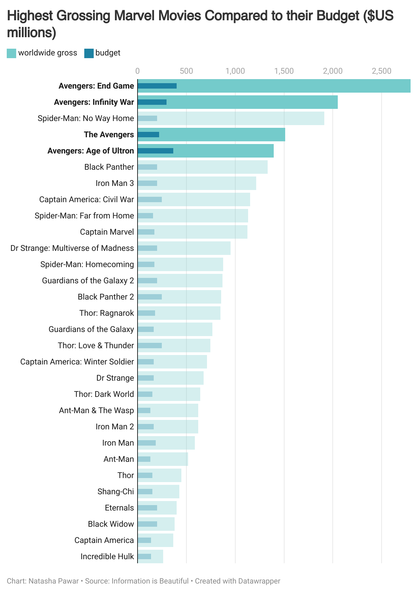

| [Home Page](https://natashapawar.github.io/dataviz-portfolio/) | [Visualizing Government Debt](https://natashapawar.github.io/dataviz-portfolio/visualizing-government-debt) | [Critique by Design](https://natashapawar.github.io/dataviz-portfolio/critique-by-design) | [Final Project I](https://natashapawar.github.io/dataviz-portfolio/final-project-part-one) | [Final Project II](https://natashapawar.github.io/dataviz-portfolio/final-project-part-two) | [Final Project III](https://natashapawar.github.io/dataviz-portfolio/final-project-part-three) |

# Makeover Monday: Critique by Design

## Part 1: Choosing a Visualization

The data visualization I chose is titled, [“Which is the Best Performing Marvel Movie?”](https://informationisbeautiful.net/visualizations/which-is-the-best-performing-marvel-movie/) by Information is Beautiful. It presents a comparative analysis of Marvel films based on multiple performance metrics. The visualization ranks Marvel Cinematic Universe (MCU) films using a combination of critical reception (Rotten Tomatoes scores), audience ratings (IMDb scores), box office revenue (adjusted for inflation), and profitability. 

I chose this visualization as it aligns well with my academic area of focus. I have also been a fan of the MCU (although more so the earlier years), and I'm always interested in looking into how these movies fair in general audience ratings.

## Part 2: The Critique 

I critiqued this visualization using Stephen Few's Data Visualization Effectiveness Profile.

| Criteria       | Usefulness |Completeness | Perceptibility | Truthfulness | Intuitiveness | Aesthetics | Engagement
|-----------|--------|--------|--------|---------|-------|-------|-------|
| Rating     | 8      |10      | 6      |9 | 9      | 6      |10      | 
  
*Observations:* The visualization effectively shows Marvel movies and their performance relative to their budgets over time. The color-coding by franchise and the ability to filter by franchise is very effective for identifying trends within each Marvel sub-franchise. For example, it's easy to see how Avengers movies consistently outperform in profitability. The inclusion of movie names next to each data point is very helpful for quickly identifying specific films without additional interaction. The ability to update and change the axes to further interact with the data also adds a lot of value to the interpretations possible. It is immediately clear that Avengers: Endgame and Spider-Man: No Way Home are clear leaders in profitability, while Incredible Hulk and Black Widow are among the lower performers. 

*What Worked Well:* The dotted line indicating breakeven (100% budget recovery) helps viewers easily distinguish profitable movies from those that underperformed. The legend makes it easy to filter and group movies by franchise, adding even more clarity. The graph effectively communicates which Marvel movies were the most profitable relative to their budget, not showing causation but rather relating the data. The information is extremely valuable to any stakeholders or fans who may be interested in it and want to know more - they also have the ability to switch axes to draw more correlations.

*What Didn’t Work Well:* Movies with similar release years or similar performance (ex: 400% budget recovered) have overlapping labels and points, making some parts of the visualization cluttered and harder to read. The information feels very congested, and while you can filter or change things to understand it better, upon first glance it is extremely overwhelming to understand.

*Suggested Changes:* Instead of having "size = no metric," we could use bubble size to indicate total gross revenue, enabling the viewer to compare absolute performance alongside relative profitability. It could be useful to spread apart the data more, leaving more space on the x and y axis and adding a scroll feature to give each movie enough space, even when the numbers are slightly overlapping. Including the major Marvel phases (Phase 1, Phase 2, etc) as annotations or markers could also add context to the timeline, as Marvel is known for these distinctive phases and movies that correlate with these phases. A simplified approach could also be using stacked bars to maintain the focus on a few specific metrics and comparing them with one another, with the option to select multiple metrics to create each bar.

*Primary Audience:* The primary audience for this visualization are 1. Marvel Fans and Movie Enthusiasts, 2. Industry Professionals and 3. Academics/Students. The first category of people could be fans who are interested in understanding the financial success of their favorite Marvel movies and how each one performed relative to the other, as well as seeing which movies were the most profitable and how their favorite franchises stack up over time. The second could be professionals in the entertainment industry, such as movie producers, marketers, and financial analysts, who need insights into profitability trends, ROI, and how different Marvel sub-franchises perform. The visualization could help stakeholders understand the financial dynamics of blockbuster movies and guide investment decisions in future projects. The third could be those studying business, media economics/management, etc.

The graph is visually engaging, with color-coded franchises making it easy for viewers to identify their favorite movies. The use of ROI and budget data provides industry professionals with insights into financial efficiency and the visualization helps identify temporal trends. The breakeven line is also a helpful visual anchor that distinguishes movies. The labeling of movie titles next to data points also reduce the need to guess which data belongs to which movie, making it effective overall. Some challenges could be the overlapping data points (especially around the breakeven line or movies released in the same year) may make it harder to extract insights quickly as well as the oversaturation of information.
Overall, the visualization is partially effective for reaching its intended audiences. It is engaging and easy to follow but could be enhanced by reducing clutter.

*Final Thoughts:* Stephen Few's method focuses on universal principles but doesn't always account for the intended audience’s unique needs or expertise. For instance, fans might prioritize visual storytelling and entertainment, while industry professionals might prioritize financial details and interactivity. It also does not evaluate the interactivity of a visualization, which is especially relevant in modern, dynamic tools. One recommendation could be to improve the layout to reduce clutter and overlapping labels. The overlapping data points and labels make it hard to read the visualization, particularly for movies released in the same year or with similar profitability. A change for this could be using a stacked bar chart and colors for each segment to visually distribute and compare the data between movies in a better way. This change, along with having the interactivity feature of changing how many dimensions the viewer is seeing at a specific time would also enhance the overall visual.

Another recommendation could be using a diverging color scale to represent the profitability or budget of the film to make it more visually intuitive. This would make it easier for viewers to compare movies’ financial performance at a glance, regardless of the franchise, and reduce reliance on the legend for interpretation.

## Part 3: Sketching Solutions

In developing a sketch for this dataviz, I brainstormed a few different solutions, keeping in mind my current skillset and applications available. 

I wanted to make the visual a little less busy, especially considering the number of movies the original visualization was taking into account. I specifically wanted to tell the story of budget vs gross profits, making it easier to compare the budget of the film with the worldwide profit. While I think all the data the original visualization is extremely informative and beneficial, I don't think it tells a specific story - which is what I was seeking to rectify with the rework. 

In an ideal world, I would like to make the visualization in a manner that each metric (ex: Audience Score (%), Critics Score (%), International Profit, Domestic Profit) could be added in different bars side by side and interchanged to be able to tell a different story as per the requirement in an manner that is easier and more intuitive to visualize and compare. 

<noscript></noscript><object class='tableauViz'  style='display:none;'><param name='host_url' value='https%3A%2F%2Fpublic.tableau.com%2F' /> <param name='embed_code_version' value='3' /> <param name='site_root' value='' /><param name='name' value='Book1_17394196372020&#47;Sheet1' /><param name='tabs' value='no' /><param name='toolbar' value='yes' /><param name='static_image' value='https:&#47;&#47;public.tableau.com&#47;static&#47;images&#47;Bo&#47;Book1_17394196372020&#47;Sheet1&#47;1.png' /> <param name='animate_transition' value='yes' /><param name='display_static_image' value='yes' /><param name='display_spinner' value='yes' /><param name='display_overlay' value='yes' /><param name='display_count' value='yes' /><param name='language' value='en-GB' /><param name='filter' value='publish=yes' /></object>
                

## Part 4: Testing the Solution

| Question | Interview 1: Female, Mid 20's | Interview 2: Female, Mid 20's |
|----------|-------------|-------------|
| Can you tell me what you think this is?| A comparison of budget vs profit for Marvel films            | Comparing the budget and profit of films             |
| Can you describe to me what this is telling you?| Budget doesn't predict the profit of a movie            | The profit of a movie is dependent on the franchise            |
| Is there anything you confusing?| It's hard to compare the profit and budget of each film            | The bars aren't close to each other, making it harder to compare them            |
| Who do you think is the intended audience for this?|  Marvel fans           | Stakeholders at Marvel + Entertainment professionals             |
| Is there anything you would change or do differently?| Potentially have two x axes - one above and one below, and having different colors for each bar             | Grouping the movies by franchise to highlight which ones make the most profit for Marvel + Potentially adding timelines/years to highlight which moviees came first and whether that predicts the success of movies             |

*Synthesis:*

From this feedback, I realized I need to further hone in on what story I am trying to tell with my data. While the comparison I was making was clear to the people I asked, I think the comparison was not as intuitive as I was intending it to be. This made it hard to tell the story I was trying to. This pattern was similar across both people.

In addition, while it would be beneficial to add the franchises in either a different color or labels, I think this would add to the busyness of the visualization. The story of franchise difference is also not what I was intending to tell, therefore, while that might be beneficial to add, I don't plan on adding that element, however, will take it into account if there was a different intended audience or purpose.

In my final redesign, I will work to make this comparison more apparent. 

## Part 5: Building the Final Solution

For my final solution, I took into account the feedback I received as well as the aim of my story. I experimented with a grouped bar and stacked bar format, but I didn't think it was as impactful as a bullet chart, which I believed more intuitively illustrated the difference in budget and profit. 

Taking into account the need of highlighting, or grouping by franchise, I also decided to focus on the Avengers franchise, given that it is the most popular Marvel Franchise. I made the colors different shades of blue, with the budget being a dark blue and the profits being a lighter blue to highlight the stark comparison between the two. 

I believe these changes have taken into account the concerns brought up in the critique, as well as allow for the original story to be highlighted, creating an improved visualization.

