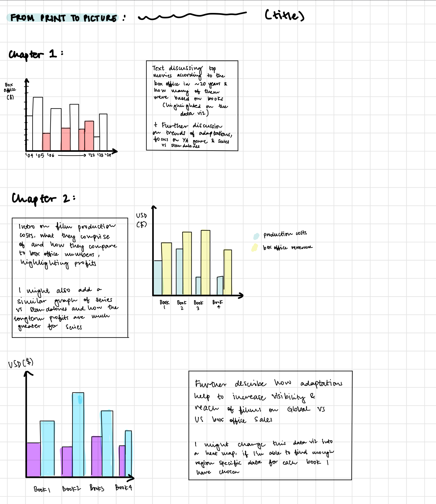
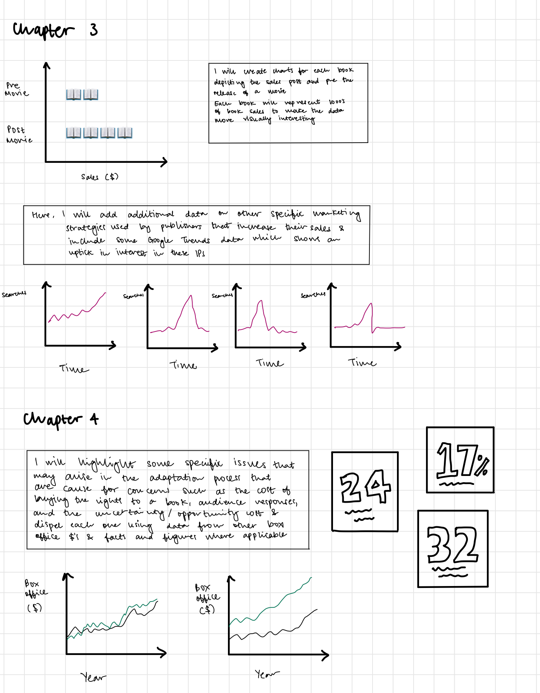
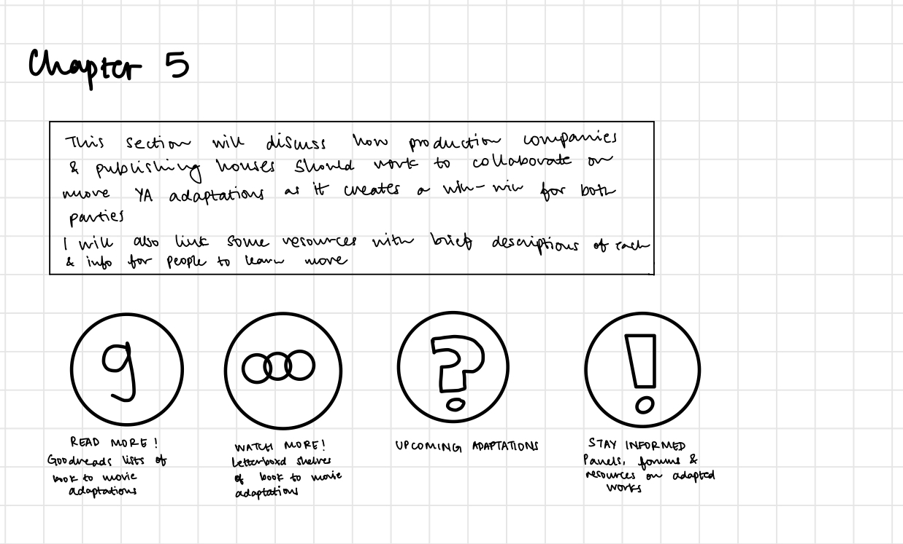

| [Home Page](https://natashapawar.github.io/dataviz-portfolio/) | [Visualizing Government Debt](https://natashapawar.github.io/dataviz-portfolio/visualizing-government-debt) | [Critique by Design](https://natashapawar.github.io/dataviz-portfolio/critique-by-design) | [Final Project I](https://natashapawar.github.io/dataviz-portfolio/final-project-part-one) | [Final Project II](https://natashapawar.github.io/dataviz-portfolio/final-project-part-two) | [Final Project III](https://natashapawar.github.io/dataviz-portfolio/final-project-part-three) |

# Final Project Part 1

## From Print to Picture: Analyzing the Impact of Book-to-Movie Literary Adaptations

## Outline
### Summary
This project concentrates on the economic implications of adapting books into movies, analyzing how these adaptations influence box office performance and audience engagement, and outweigh the heavy production costs (ex: buying the rights to the film). The study will evaluate the financial outcomes of these adaptations, looking at different standalone adaptations and series and their success rates, and how well these films do in domestic versus international markets. It will also consider the indirect effects on the visibility and longevity of the source books, and therefore publishers, creating a win-win scenario for both.

Objective: To provide a data-driven narrative that informs stakeholders in both the publishing and film industries of the significant benefits of book-to-movie adaptations, encouraging more thoughtful and faithful adaptation practices that respect the source material while maximizing economic and cultural impact.

### Structure 

**Chapter 1: The Set Up**

In this section I will talk about the growing popularity of books being adapted to movies, a brief process of adapting a literary work into a movie and some of the most notable adaptations and discuss trends in the space. I will then drill down my focus on specific literary works (I currently plan on using The Hunger Games, Harry Potter, Twilight and The Lord of the Rings).

**Chapter 2: The Impact on the Film Industry**

In this section I will focus on discussing the benefits of adapting books to movies, highlighting the differences between standalone adaptations and series adaptations
- *Box Office Impact:* I will provide data-driven insights into the box office performance of adaptations vs original films in a specified year, using graphs and comparative statistics including budget vs. earnings comparisons
- *Global Success:* I will also include the reach of such films, including data on global box office metrics and market reception.

**Chapter 3: The Impact on the Publishing Industry**

Although there is limited publicly available data, this section will focus on the indirect effects of the adapted films on publishers
- *Sales Surge:* I will include specific examples, where available, of the effect of movie adaptations on book sales, with before-and-after analysis, highlighting any long-term impacts on the author's subsequent works.
- *Marketing Strategies:* I will also also include relevant details on how publishers capitalize on the film release with special editions, marketing strategies, and cross-promotional activities which generate additional revenues. I will also supplement this with data from Google Trends, to talk about how there is an uptick in searches for the IP as well. 

**Chapter 4: Potential Issues**

Here I will highlight specific challenges encountered in the adaptation process, such as cost constraints, the uncertainty of knowing whether a film will be successful, the increase in audience responses and engagement, and factors that can lead to successful adaptations.

**Chapter 5: Future Directions** (Call to Action)

In my final section, I will encourage stakeholders in both industries to consider the benefits of staying true to the source material and proposing guidelines or criteria to ensure respectful and successful adaptations. I will also add material for future works that are in the process of being adapted, or books that have had their rights bought by known production companies. I will also include links to Goodreads and Letterboxd, where people can review books and movies as well as any material that is relevant to the discussion of adapted works such as books, panels, interviews, support for appropriate pay for authors etc.

## Initial Sketches

# The Data

I plan on predominantly using data from The Numbers for box office values both globally and regionally, within the US. I  will use this website for a comparison of movies that are literary based and original IP-based, highlighting how some of the most popular movies are adapted. I will also use the website for the information on production costs for each movie and I will use those numbers, extract them into an excel and further calculate the profit made on each movie. 

The Statista data set is an example, using Hunger Games for book sales before and after the release of the movie. I plan to find additional similar data for my other chosen books, where data is available. In the cases where I can't find this data on Statista, I will pull from sources to create my own dataset. I will also input the names of these books into Google Trends to identify the rise in searches, attention and engagement that general consumers have with adapted content, indirectly resulting in increased revenues for publishing companies and production houses.

There are also additional links I will incorporate into my story, adding links of Goodreads lists that rank book to movie adaptations by ratings, Letterboxd lists for the same and additional guides in the form of books, panels and links that talk about adaptations, how they happen and information about there being more equitable pay for authors and lastly, some news pieces on upcoming works that have been auctioned or are in development. 

Text here...

| Section     | Source        | Description | Link        |
|-------------|---------------|-------------|-------------|
| Chapter 1     | The Numbers   | This dataset shows the biggest movie franchises – I will use this to show how a majority of them are book based            | [1](https://www.the-numbers.com/movies/franchises)            |
| Chapter 1 + 2 | The Numbers   | This dataset shows the data for costs + box office numbers of young adult adaptations. I will use this to highlight the revenues that these films make            | [2](https://www.the-numbers.com/movies/keyword/Young-Adult-Book-Adaptation)            |
| Chapter 1 + 2 | The Numbers      | This dataset shows the data for costs + box office numbers of other book adaptations. I will use this to highlight the revenues that these films make            | [3](https://www.the-numbers.com/movies/source/Based-on-Fictional-Book-or-Short-Story#tab=year)            |
| Chapter 3   | Statista | Show the increase in sales of Hunger Games and pre and post movie release, I will use this to discuss the benefits for publishers             | [4](https://www-statista-com.us1.proxy.openathens.net/statistics/291353/hunger-games-trilogy-unit-sales/)            |
| Chapter 3   | Google Trends | Used for each selected movie to discuss the increase in engagement and interest for the specific IP             | [5](https://trends.google.com)            |

*As mentioned above, I am still looking for additional data sources for book sales, and plan on creating my own Excel file collating data from different sources.*

# Method and Medium
I will use Tableau and Shorthand for this project. I may also use Canva, or other graphic-generating sources to incorporate single-point-in-time statistics to call out various facts and figures where necessary.
