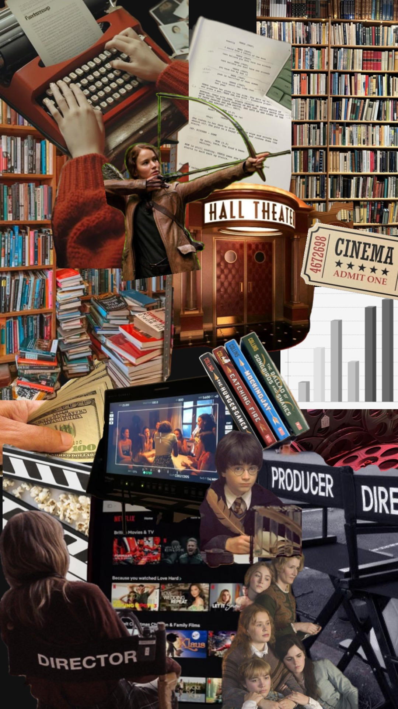

| [Home Page](https://natashapawar.github.io/dataviz-portfolio/) | [Visualizing Government Debt](https://natashapawar.github.io/dataviz-portfolio/visualizing-government-debt) | [Critique by Design](https://natashapawar.github.io/dataviz-portfolio/critique-by-design) | [Final Project I](https://natashapawar.github.io/dataviz-portfolio/final-project-part-one) | [Final Project II](https://natashapawar.github.io/dataviz-portfolio/final-project-part-two) | [Final Project III](https://natashapawar.github.io/dataviz-portfolio/final-project-part-three) |

# Wireframes / storyboards

[ShortHand Wireframe](https://preview.shorthand.com/zed4GBSSytJbY5e1/responsive/desktop)

>Initial Chapter 1: The Set Up

>In this section I will talk about the growing popularity of books being adapted to movies, a brief process of adapting a literary work into a movie and some of the most notable adaptations and discuss trends in the space. I will then drill down my focus on specific literary works (I currently plan on using The Hunger Games, Harry Potter, Twilight and The Lord of the Rings).

**Updated Chapter 1:** 

>Initial Chapter 2: The Impact on the Film Industry
>In this section I will focus on discussing the benefits of adapting books to movies, highlighting the differences between standalone adaptations and series adaptations
>- *Box Office Impact:* I will provide data-driven insights into the box office performance of adaptations vs original films in a specified year, using graphs and comparative statistics including budget vs. earnings comparisons
>- *Global Success:* I will also include the reach of such films, including data on global box office metrics and market reception.

**Updated Chapter 2:** 

>Initial Chapter 3: The Impact on the Publishing Industry
>Although there is limited publicly available data, this section will focus on the indirect effects of the adapted films on publishers
>- *Sales Surge:* I will include specific examples, where available, of the effect of movie adaptations on book sales, with before-and-after analysis, highlighting any long-term impacts on the author's subsequent works.
>- *Marketing Strategies:* I will also also include relevant details on how publishers capitalize on the film release with special editions, marketing strategies, and cross-promotional activities which generate additional revenues. I will also supplement this with data from Google Trends, to talk about how there is an uptick in searches for the IP as well. 

**Updated Chapter 3:** 

>Initial Chapter 4: Potential Issues
>Here I will highlight specific challenges encountered in the adaptation process, such as cost constraints, the uncertainty of knowing whether a film will be successful, the increase in audience responses and engagement, and factors that can lead to successful adaptations.

**Updated Chapter 4:** 

>Initial Chapter 5: Future Directions** (Call to Action)
>In my final section, I will encourage stakeholders in both industries to consider the benefits of staying true to the source material and proposing guidelines or criteria to ensure respectful and successful adaptations. I will also add material for future works that are in the process of being adapted, or books that have had their rights bought by known production companies. I will also include links to Goodreads and Letterboxd, where people can review books and movies as well as any material that is relevant to the discussion of adapted works such as books, panels, interviews, support for appropriate pay for authors etc.

**Updated Chapter 5:** 

I am still working on my visualizations to ascertain exactly what data would make my story the most compelling, as well as ensuring that the examples I use to support my story are universally known.

# User Research 

As I begin to start seeking user feedback, I hope to start gain better insight into whether my intended story is being reflected, and what I can do to update and enhance the user experience. Since data for this particular topic is a little hard to find, I will beging my narrowing my scope and identifying exactly which franchises and standalones I am trying to show, and ensuring that focus is supporting the story I am trying to tell. I also want to test whether the story resonates with my intended audiences.

## Target Audience:

- General Public: Casual book readers and movie watchers who consume content that is interesting to them, not specifically inclined to one or the other, however, those who have industry knowledge and frequently engage with discourse related to their preferred content. 
- Literary Fiction Fans: Individuals who consume both literary content as well as watch films and TV and fall at the intersection of the two. For these individuals, my primary focus is identifying whether they enjoy seeing their favorite fiction come to life, what they like about it, points of concerns and what industry leaders can do differently to ensure their needs are met.
- Industry Professionals: Stakeholders who are interested in knowing where to put their money when it comes to creating, acquiring and developing new content that resonates with a wide range of audiences. In addition to this, stakeholders who are in the publishing industry who are seeking film and TV professionals to help them adapt and bring their content to live-action.

Keeping these audiences in mind, I want to interview users who fall into each category and ensure that the information I am providing resonates and provides value to each group.

Interview 1: Female, early 20s, graduate student, casual reader and avid movie watcher 
Interview 2: Female, mid 20s, Digital Production Executive, avid book reader and movie watcher
Interview 3: Male, mid 30s, Media and Entertainment Consulting Professional, knowledge of current affairs in the entertainment landscape 

### Interview Script

| Goal | Questions to Ask |
|------|------------------|
| Understand if the story is easy to follow | What is your initial response to the structure of the story and what do you think it is trying to tell you?                  |
| Identify what elements resonate the most with the audience     | Was there anything you found surprising or interesting?                  |
| Determine what could be done differently to tell a more impactful story     | What could be done differently to make the story more compelling (specifically any other elements or data points to add/remove)?                 | 
| Find out whether the call to action logically flows into the story      | Did the call to action tie into the story?                 |

### Interview Findings

Text here!

| Questions               | Interview 1 | Interview 2 | Interview 3 |
|-------------------------|--------------------------------|-------------|-------------|
| What is your initial response to the structure of the story and what do you think it is trying to tell you? | Insightful feedback            |             |             |
| Was there anything you found surprising or interesting?                        |                                |             |             |
| What could be done differently to make the story more compelling (specifically any other elements or data points to add/remove)?                        |                                |             |             |
|Did the call to action tie into the story?                         |                                |             |             |

Overall, the feedback I received from my user research was positive and constructive.

>Overall, I received positive feedback on the visualizations and general story outline. There are a few elements to clean up on the visualizations, but the response was that it all supported the story. During the in-class critique, one classmate suggested making the Top Grossing Films of the Past 20 Years into a tree map (rather than a highlighted table) to make a bigger impact. Whereas another viewer noted that visualization stood out to them, with the data being a surprise. I may play around with this idea of a tree map and see if it fits with my vision for the layout. One of my goals with the feedback was to see if it was too much or just the right amount, and in this case, it felt like the right amount to my interviewees.

>From the feedback I received both from my interviews and classmates, the main thing I need to focus on is the message for the casual viewer. I felt like I had a good grasp going in, but I can see where this needs to be improved. A common theme was that the story was interesting, but they did not feel compelled to go do something. Along the same lines, one classmate noted that general people don’t think about IP when they go to the movies, so I should emphasize why they should go to the movies and incorporate that into the topic. Another note from the class was that if my call to action (Letterboxd) can be used for films both in and out of theatres (on streaming), why, then, is watching at home a bad thing? They were unclear on the main point that the story is to get more people to the movies and that IP has been driving the box office.

# Identified Changes for Part III
> Document the changes you plan on implementing next week to address any issues identified.  

Text here!

| Research synthesis                       | Anticipated changes for Part III                                                |
|------------------------------------------|---------------------------------------------------------------------------------|
| Findings or observations from interviews | Describe what, if any changes you anticipate making to address the observation. |
|                                          |                                                                                 |
|                                          |                                                                                 |
|                                          |                                                                                 |
| ...add more rows as necessary            |                                                                                 |

> ...include any final thoughts you have here. 

Text here!

# Moodboard

 
Text here!

